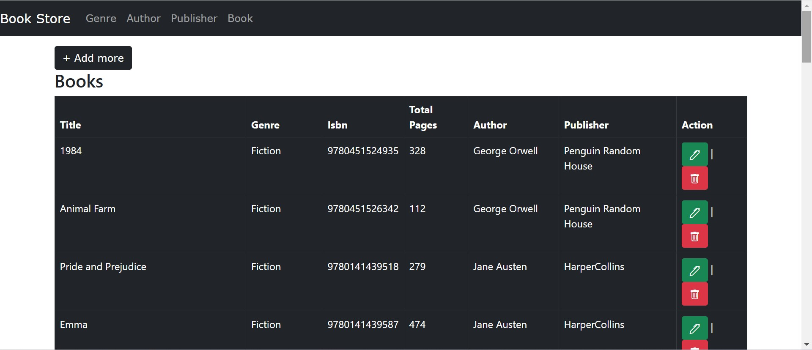

# YtBookStore

Now upgraded to .net 9.0

## How to run the project

1. clone the project

   ```bash
      git clone https://github.com/rd003/YtBookStore.git
   ```
     
3. open `appsettings.json` file and update connection string's `data source=your server name`
   
   ```json
    "ConnectionStrings": { "conn": "data source=RAVINDRA\\MSSQLSERVER01;initial catalog=YtBookStore;integrated security=true;encrypt=false"
    }
   ```
   
4. Open Tools > Package Manager > Package manager console
5. Run thia command `update-database`
6. Now you can run this project

## Seed data with database script

```sql
use YtBookStore;
go

-- Insert Genres
INSERT INTO [dbo].[Genre] ([Name]) VALUES
('Fiction'),
('Science Fiction'),
('Fantasy'),
('Mystery'),
('Biography'),
('History'),
('Romance'),
('Self-Help'),
('Poetry'),
('Horror');

-- Insert Authors
INSERT INTO [dbo].[Author] ([AuthorName]) VALUES
('George Orwell'),
('J.K. Rowling'),
('Agatha Christie'),
('Isaac Asimov'),
('Stephen King'),
('Jane Austen'),
('Yuval Noah Harari'),
('Dale Carnegie'),
('William Wordsworth'),
('Edgar Allan Poe');

-- Insert Publishers
INSERT INTO [dbo].[Publisher] ([PublisherName]) VALUES
('Penguin Random House'),
('HarperCollins'),
('Macmillan'),
('Simon & Schuster'),
('Hachette Livre');

-- Insert Books
INSERT INTO [dbo].[Book] ([Title], [Isbn], [TotalPages], [AuthorId], [PubhlisherId], [GenreId]) VALUES
-- Fiction (4 books)
('1984', '9780451524935', 328, 1, 1, 1),
('Animal Farm', '9780451526342', 112, 1, 1, 1),
('Pride and Prejudice', '9780141439518', 279, 6, 2, 1),
('Emma', '9780141439587', 474, 6, 2, 1),

-- Science Fiction (6 books)
('Foundation', '9780553293357', 244, 4, 3, 2),
('I, Robot', '9780553382563', 224, 4, 3, 2),
('Dune', '9780441013593', 688, 4, 1, 2),
('Ender''s Game', '9780812550702', 324, 4, 2, 2),
('The Martian', '9780553418026', 369, 4, 4, 2),
('Hyperion', '9780553283686', 482, 4, 4, 2),

-- Fantasy (5 books)
('Harry Potter and the Sorcerer''s Stone', '9780439708180', 309, 2, 3, 3),
('Harry Potter and the Chamber of Secrets', '9780439064873', 341, 2, 3, 3),
('Harry Potter and the Prisoner of Azkaban', '9780439136365', 435, 2, 3, 3),
('The Hobbit', '9780547928227', 310, 2, 5, 3),
('The Lord of the Rings', '9780544003415', 1178, 2, 5, 3),

-- Mystery (7 books)
('Murder on the Orient Express', '9780062693662', 256, 3, 2, 4),
('And Then There Were None', '9780062073488', 272, 3, 2, 4),
('The Mysterious Affair at Styles', '9780062073556', 224, 3, 2, 4),
('The Murder of Roger Ackroyd', '9780062073563', 288, 3, 1, 4),
('The Girl with the Dragon Tattoo', '9780307949486', 465, 3, 4, 4),
('The Da Vinci Code', '9780307474278', 489, 3, 5, 4),
('Angels & Demons', '9780743493468', 736, 3, 5, 4),

-- Biography (5 books)
('Sapiens: A Brief History of Humankind', '9780062316110', 443, 7, 1, 5),
('Becoming', '9781524763138', 448, 7, 3, 5),
('Steve Jobs', '9781451648539', 656, 7, 4, 5),
('The Diary of a Young Girl', '9780553296983', 283, 7, 5, 5),
('Long Walk to Freedom', '9780316548182', 656, 7, 2, 5),

-- History (4 books)
('Guns, Germs, and Steel', '9780393317558', 496, 7, 1, 6),
('The History of the Ancient World', '9780393059748', 896, 7, 3, 6),
('A People''s History of the United States', '9780062397348', 729, 7, 4, 6),
('The Silk Roads', '9781101912379', 636, 7, 5, 6),

-- Romance (5 books)
('The Notebook', '9781455582877', 224, 6, 1, 7),
('Me Before You', '9780143124542', 369, 6, 2, 7),
('Outlander', '9780440212560', 850, 6, 3, 7),
('P.S. I Love You', '9780786890750', 470, 6, 4, 7),
('The Rosie Project', '9781476729091', 295, 6, 5, 7);
```
## Screenshot(s)

   
